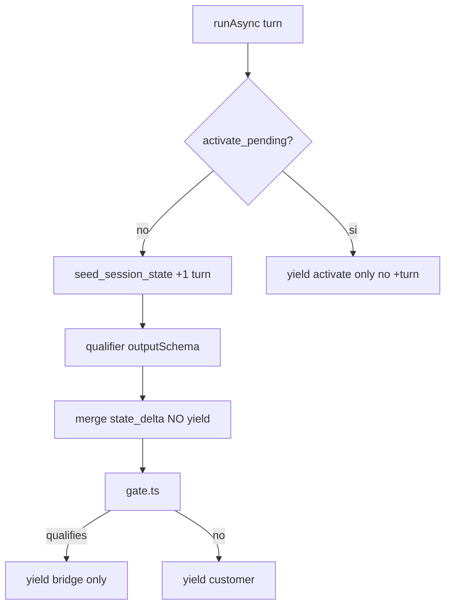

# Plan: paridad Python → ADK TS (repo `nestjs-adk`)

Eres el implementador en [nicobytes/nestjs-adk](https://github.com/nicobytes/nestjs-adk). **No** toques el monorepo Chatty. **No** clones `projects/agents/amaru` entero, ni `chatty-agent-common`, ni Supabase, ni RAG, ni agenda Be Unique.

Este `.md` es autocontenido: **no** crees `docs/` ni `AGENTS.md` extra. Cópialo al POC y ejecútalo. El veredicto de cola (Bull) ya está en `RESULTS.md` — **no lo reescribas**. Entrega **`RESULTS-port-python.md`**.

## Qué pregunta cierra esto

¿Se puede **portar el cerebro de Amaru** a `@google/adk` JS (mismo proceso Nest que el POC), no solo un `LlmAgent` + `ask_choice`?

Amaru en Python **no** es un chatbot. Cada turno:

1. `qualifier` (flash-lite, `output_schema`, **sin tools**) — events **no** se yield a Nest.
2. Código (`qualification.py`) aplica el gate de **cuatro caminos** + turn-1.
3. Si handoff → solo `bridge` (texto de cierre). **No** corre `customer`.
4. Si `activate_pending` → solo `activate`. **No** qualifier, **no** bump de `user_turn_count`.
5. Si no → yield `customer`.
6. Customer usa `static_instruction` + instruction dinámica, `BuiltInPlanner`, callbacks (`before_model` limpia JSON BANT, `after_tool` corta tras `reply_with_*`).
7. `App(context_cache_config=ContextCacheConfig(ttl=3600, cache_intervals=10, min_tokens=2048))`.

El feature probe del POC ya dijo: `BuiltInPlanner` y `ContextCacheConfig` **no existen** en `@google/adk` 2.0 (checks B y G). **No** vuelvas a `import` eso. Mide workarounds (`thinkingConfig`, prompt entero).

## Qué no hace falta

- Bull, Redis, buffer, HITL skip de cola, dual-write CRM (ya en `RESULTS.md`).
- `search_context`, KB, `book_appointment`, skills Be Unique, pin de sede.
- Copiar `personality.md` / datasets JSON de Chatty al repo (reescribe 8–12 casos abajo).
- Graph / Kapso / multi-tenant.
- Port de Apana/Tiqui.

Sí hace falta un **stub de producto** en TS:

```
src/agents/amaru-lite/
  gate.ts              # 4 caminos + turn-1 (puro, sin LLM)
  orchestrator.ts      # BaseAgent
  qualifier.ts         # LlmAgent outputSchema O fake inyectable
  bridge.ts / activate.ts / customer.ts
  callbacks.ts
  state.ts             # keys: user_turn_count, activate_pending, bant_result, lead_qualifies
```

Auth: `GOOGLE_API_KEY`. Live Gemini solo donde el modelo tiene que clasificar o hablar. El **gate y el routing del orchestrator se testean con qualifier fake** (sin key).

---

## Gate (copia este contrato; no improvises)

`qualifies === true` solo si:

1. `explicit_human_request` **o**
2. `disability_access_inquiry` **o**
3. (`plan_and_date_confirmed` **o** `custom_group_accepted`) **y** `budget_status !== 'Insufficient'`

**Score ≥ 70 no califica.** Fecha suelta, “quiero reservar” en turno 1, pick de lista **no** abren handoff.

Turn-1: `user_turn_count === 1` bloquea handoff **salvo** (1) o (2).

Razones canónicas (prioridad):

- humano → `"Cliente solicitó atención humana."`
- discapacidad → `"Consulta por discapacidad o accesibilidad."`
- grupo → `"Quiere armar grupo o fecha a medida."`
- plan+fecha → `"Plan y fecha confirmados para reserva."`

Handoff en el POC = `state.handoff_phase = 'WAITING_HUMAN'` + yield **solo** texto de bridge. No llames CRM Chatty. No uses `request_human_handoff` tool.

`BantSignals` (qualifier `outputSchema`):

```ts
{
  interest_level: 'Low' | 'Medium' | 'High',
  budget_status: 'NotMentioned' | 'Insufficient' | 'Aligned',
  purchase_urgency: 'Immediate' | 'ShortTerm' | 'LongTerm' | 'Uncertain',
  has_decision_authority: boolean,
  explicit_human_request: boolean,
  plan_and_date_confirmed: boolean,
  custom_group_accepted: boolean,
  disability_access_inquiry: boolean,
}
```

---

## Arquitectura del experimento



`EveOrchestrator` del probe **no** vale: hace yield del qualifier y no tiene gate. Reemplaza o añade `AmaruLiteOrchestrator`. No lo registres como default de `/inbound` si rompe tests viejos: `agentId: 'amaru_lite'`.

---

## Experimento P0 — gate sin LLM (obligatorio, barato)

`src/agents/amaru-lite/gate.ts` + `test/amaru-lite-gate.spec.ts`.

Tests fijos:

1. `it('human request qualifies even on turn 1')`
2. `it('disability qualifies even on turn 1')`
3. `it('plan and date confirmed does not qualify on turn 1')`
4. `it('plan and date confirmed qualifies on turn 2+')`
5. `it('score 90 without a path does not qualify')`
6. `it('insufficient budget blocks plan-and-date and custom group')`
7. `it('insufficient budget does not block human or disability')`
8. `it('handoff reason priority is human then disability then group then plan')`

Si P0 falla, es un bug tuyo, no de ADK. No sigas.

---

## Experimento P1 — orchestrator `BaseAgent` (obligatorio)

Qualifier **inyectable**: en tests, un fake que escribe `ctx.session.state.bant_result` (objeto BantSignals) y emite un event de modelo con JSON. El orchestrator **no debe yield** ese event.

Bridge / activate / customer: fakes que yield un `Event` de texto (`author` = nombre del sub-agente). Customer fake **no** debe correr en handoff.

`before_agent`-equivalente: incrementa `user_turn_count` salvo `activate_pending`.

Tests (`test/amaru-lite-orchestrator.spec.ts`), **sin** Gemini:

1. `it('does not yield qualifier events to the stream')` — `runAsyncImpl` collect: ningún part.text igual al JSON BANT; `state.bant_result` sí quedó.
2. `it('runs only bridge when gate qualifies')` — fake human request; autores yielded = orchestrator/bridge, **nunca** customer.
3. `it('runs customer when gate does not qualify')` — turn 2, sin paths.
4. `it('blocks plan-and-date handoff on turn 1')` — `user_turn_count` arranca 0; primer `runAsync` no bridge.
5. `it('activate_pending skips qualifier and does not bump turn count')` — state previo `{ activate_pending: 'true', user_turn_count: 3 }`; yielded activate; turn count sigue 3; `activate_pending` limpio.
6. `it('handoff does not run customer even if customer fake would throw')` — customer `throw`; human path no lanza.

**Fail ADK (no-go port):** no puedes recorrer un sub-agente **sin** yield; no hay `session.state` mutable; `BaseAgent.runAsyncImpl` no puede early-return. Documenta la API que falta.

**Pass:** el routing de Amaru es portable. Aún no es go de producto.

Live opcional (key): qualifier real clasifica “quiero hablar con un asesor” → `explicit_human_request: true` → solo bridge. Skip si no hay key.

---

## Experimento P2 — callbacks + historial (obligatorio)

Python: `before_model_callback=strip_internal_bant_contents`, `after_tool_callback=stop_turn_after_outbound_intent`, `on_tool_error_callback=recover_unknown_tool_error`.

En JS busca equivalentes en `LlmAgent` / plugins (`beforeModel`, `afterTool`, `onToolError`). El probe ya tiene `BasePlugin.onToolErrorCallback`.

Tests:

1. `it('strips bant json from contents before the next model call')` — sesión con un event user/model que contiene `{"interest_level":...}` o `bant_result`; el payload que ve el modelo (spy de `generateContent` o callback) **no** incluye ese JSON. Si no hay palanca de callback, **fail** documentado: el customer relee BANT (Amaru lo prohíbe en WhatsApp).
2. `it('stops the turn after outbound intent tool')` — customer tool `reply_with_text` (stub, no Graph). Tras execute, no hay segunda functionCall en el mismo `runAsync`. Analog Python `stop_turn_after_outbound_intent`.
3. `it('unknown tool error is recoverable not a crash')` — boom tool / nombre inventado → functionResponse con `error_code` TOOL_NOT_FOUND o TOOL_ERROR, proceso vivo.

`reply_with_text` aquí es un `FunctionTool` que pone `{ intent: 'reply_with_text', body }` en state o return **corto** (Eve gist). No mandes Graph. El canal fake puede `sendText(body)`.

---

## Experimento P3 — cache y thinking (obligatorio medir, no re-import)

Tabla en `RESULTS-port-python.md`:

| Palanca Python | En `@google/adk` JS | Evidencia | Impacto |
|---|---|---|---|
| `BuiltInPlanner(thinking_config)` | ausente (probe) | — | ¿`generateContentConfig.thinkingConfig` basta? |
| `ContextCacheConfig` en `App` | ausente (probe) | — | ¿cada turno reenvía personality? |
| `static_instruction` vs `instruction` | ? | código + 1 log | ¿se puede partir prefijo estable? |

Cómo medir **sin** mentir:

- **Thinking:** customer live, 5 turnos “hola” / “qué planes hay” (customer **sin** RAG: responde “no inventes planes”). Assert: `channel.list` no contiene thought/JSON; si `includeThoughts: true` en el POC viejo, para amaru-lite usa `includeThoughts: false` (como Amaru). Compara 1 turno con budget 0 vs 1024: ¿cambia adherencia a “una sola reply tool”?
- **Cache:** si no hay API, cuenta tokens de input (log Gemini usage) en turno 2 vs 1 con un `static` de ≥2k tokens dummy. Si turno 2 ≈ turno 1 en input tokens → no hay cache → **costo-no-go** o “aceptable si el prompt se recorta”.
- **static_instruction:** si `LlmAgent` solo tiene `instruction` string/fn, documenta “un solo blob; cache de Google no aplica”. No es fail de routing.

No es no-go de orchestrator. **Es** no-go de “port barato 1:1” si el cache no existe y el static de Amaru es grande.

---

## Experimento P4 — evals handoff (go de laboratorio)

Sin copiar el JSON de Chatty. Casos mínimos (nombre fijo). Orchestrator **con qualifier fake** que el test setea según el caso (más determinista que el LLM). Un describe live opcional con qualifier real.

| id | Input / state | Esperado |
|---|---|---|
| `es_greeting_no_handoff` | t1 “hola” | customer, no WAITING_HUMAN |
| `es_no_handoff_turn1_booking` | t1 “quiero reservar el cocuy en octubre” + fake `plan_and_date_confirmed` | **no** handoff (turn gate) |
| `es_handoff_plan_and_date` | t2+ fake plan+fecha | bridge only, reason plan+fecha |
| `es_yes_after_reserve_ask` | t2+ mismo | bridge |
| `es_disability_access_handoff` | t1 fake disability | bridge, reason discapacidad |
| `es_accept_custom_group_handoff` | t2+ fake custom_group | bridge, reason grupo |
| `es_high_score_no_confirm_no_handoff` | t2+ score 90, sin paths | customer |
| `es_activate_nudge` | `activate_pending=true` | activate only, turn count intacto |
| `es_no_bant_json_on_channel` | cualquier turn customer | channel/yielded al usuario sin JSON BANT |

Tests: `test/amaru-lite-evals.spec.ts`.

Live Gemini (skipIf !key): 3 frases reales al qualifier — “hola”; “quiero un asesor”; “puedo ir en silla de ruedas al trekking” — y el gate usa el schema parseado. Si el lite falla y el fake pasa, RESULTS: “routing OK, classifier no-go / hay que tunear prompt”.

---

## Experimento P5 — contrato outbound (importante, no bloquea P1)

Una tool `reply_with_text` / `reply_with_buttons` estilo Chatty envelope **o** `ChannelService` directo (ya hay `ask_choice`). Elige **uno** y no mezcles en el mismo agente.

- Sesión: gist / `null` + `skipSummarization` (Eve `toModelOutput`). **Nunca** Graph en `session.events`.
- Canal fake: texto o botones.
- Handoff: el orchestrator ya puso WAITING_HUMAN; Nest del POC puede ignorarlo. Documenta: Chatty seguiría persistiendo status en Supabase **fuera** del Runner (como ahora Python llama handoff).

Test: `it('outbound tool result is gist not channel json')` — reutiliza el contrato I de gaps.

No portes `reply_with_list` ni location en este plan.

---

## Qué no probar (ruido)

- `BuiltInPlanner` / `ContextCacheConfig` `typeof === 'function'` otra vez.
- Bull A1–A5, HITL cola, identity `waId`.
- RAG, Ragas, skills zip, A2A card.
- Port literal de `qualification.py` + persist snapshot CRM.

---

## Tests (nombres fijos)

1. `it('human request qualifies even on turn 1')` — P0
2. `it('plan and date confirmed does not qualify on turn 1')` — P0
3. `it('score 90 without a path does not qualify')` — P0
4. `it('does not yield qualifier events to the stream')` — P1
5. `it('runs only bridge when gate qualifies')` — P1
6. `it('activate_pending skips qualifier and does not bump turn count')` — P1
7. `it('strips bant json from contents before the next model call')` — P2
8. `it('stops the turn after outbound intent tool')` — P2
9. `es_*` evals — P4
10. `it('outbound tool result is gist not channel json')` — P5

Gemini: qualifier live opcional; thinking/cache P3. El resto **debe** pasar sin key.

---

## RESULTS-port-python.md (entregable)

| Pregunta | Resultado | Evidencia |
|----------|-----------|-----------|
| ¿Gate 4 caminos + turn-1 en TS sin LLM? | | P0 |
| ¿Orchestrator swallow qualifier? | | P1 |
| ¿Handoff = solo bridge? | | P1 |
| ¿Activate no bumpa turn y no corre customer? | | P1 |
| ¿session.state sobrevive el routing? | | P1 |
| ¿Callback strip BANT existe? | | P2 |
| ¿Stop tras outbound? | | P2 |
| ¿`thinkingConfig` sustituye BuiltInPlanner? | sí / no / no medido | P3 |
| ¿Hay cache de static_instruction? | sí / no / N/A API | P3 |
| ¿Evals handoff fake verdes? | | P4 |
| ¿Qualifier live clasifica humano/discapacidad? | skip / sí / no | P4 |
| **¿Go port Amaru a TS (laboratorio)?** | | |
| **¿Go port a un tenant Chatty?** | no / sí con condiciones | |
| **¿Go port Be Unique (skills+agenda)?** | no hasta laboratorio Amaru | |

Criterio:

- **Go laboratorio:** P0 + P1 + P2 + P4 fake. P3 anotado (costo).
- **No-go cerebro:** P1 fail (no swallow / no state / no early-return).
- **No-go barato 1:1:** P3 cache ausente **y** no aceptáis el costo de reenviar personality. El routing puede seguir siendo go.
- **No-go tenant Chatty:** laboratorio OK pero last-mile `parseTurn` / HITL CRM / activate Nest no están cableados. Eso es otro plan (Nest), no este POC.
- **Be Unique:** prohibido declarar go. Skills + botones + agenda son otro hito.

Condiciones aceptables: qualifier fake en CI; live flaky; `thinkingConfig` en vez de planner; sin ContextCacheConfig; handoff no escribe Supabase.

---

## Ritmo

Día 1: P0 + P1 (fakes). Si P1 no-go ADK, RESULTS y stop.

Día 2: P2 + P4 fake.

Día 3: P3 medidas + qualifier live + P5 gist + `RESULTS-port-python.md`.

No abras WhatsApp real. No fusionar a Chatty. No toques el path `/inbound` `waId` salvo un `agentId=amaru_lite` opt-in.

## README

Una línea: paridad Python ≠ cola; ver `RESULTS-port-python.md`. Path de decisión de Bull sigue siendo el de `RESULTS.md`.
