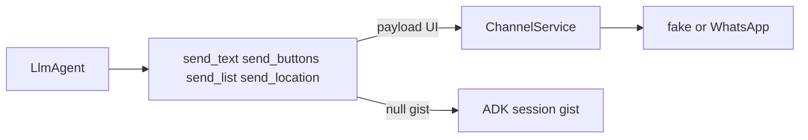

# Plan: Amaru / Be Unique sobre el canal Nest (repo nestjs-adk)

Eres el implementador en [nicobytes/nestjs-adk](https://github.com/nicobytes/nestjs-adk). **No** toques el monorepo Chatty. **No** clones `projects/agents/*` enteros, ni `chatty-agent-common`, ni schema Supabase, ni envelopes `reply_with_*` / `parseTurn`.

Este `.md` es autocontenido: **no** crees `docs/` ni `AGENTS.md` extra. Cópialo al POC. No reescribas [RESULTS.md](https://github.com/nicobytes/nestjs-adk/blob/main/RESULTS.md) (cola) ni [RESULTS-port-python.md](https://github.com/nicobytes/nestjs-adk/blob/main/RESULTS-port-python.md) (cerebro/gate). Entrega **`RESULTS-channel-agents.md`**.

`amaru_lite` (orchestrator + gate + callbacks) **ya está**. Este plan lo usa como base y le pone **producto en el canal Nest**, no un segundo cerebro.

## Qué pregunta cierra esto

¿ADK JS + `ChannelService` (pintar en `execute`, gist al modelo) puede **verse** como Amaru y luego como Sofía, **sin** el contrato Vertex `reply_with_*`?

Nest del POC ya sabe enviar texto, botones, media, pin ([`src/channel/channel.service.ts`](https://github.com/nicobytes/nestjs-adk/blob/main/src/channel/channel.service.ts)). Falta `sendList`. El modelo no debe ver Graph / Block Kit (Eve `toModelOutput`: `return null` + `skipSummarization`).



## Qué no copies

- `get_outbound_intent_tools`, `kind: outbound_intent`, `parseTurn`
- `request_human_handoff` como tool (el orchestrator ya hace handoff)
- Wheel `chatty-agent-common`, playground mirror, CTWA
- Parser completo de `search_context.py` el día 1
- Agenda real / RLS / multi-tenant
- `BuiltInPlanner` / `ContextCacheConfig` (ya ausentes; usa `thinkingConfig`)

## Mapeo de salida (único contrato)

Renombra en prompts: `reply_with_text` → `send_text`, etc.

- Texto → `channel.sendText` + `return null`
- Botones → `channel.sendButtons` + `return null`. **No** uses `LongRunningFunctionTool` / `ask_choice` para Sofía: en Python el turno **termina** y el clic es el **siguiente** inbound. Igual aquí.
- Lista → `channel.sendList` (**hay que añadirlo**; `ChannelMessage.kind` hoy no tiene `list`)
- Pin → `channel.sendLocation`. Tool `send_sede_location(sede)` con coords **en código**, el modelo no inventa lat/lng
- Tras cualquier send_* → `afterToolCallback` que ya corta el turno (`stopTurnAfterOutboundIntent`)

Inbox: dual-write existente en `push`. Extiende `inbox-view` para `kind=list`.

## Fuentes Chatty (copiar markdown, no el árbol)

Amaru (recorta playground):

- [`projects/agents/amaru/app/subagents/customer/instructions/`](projects/agents/amaru/app/subagents/customer/instructions/)
- qualifier / bridge / activate `instructions/`
- Gate: ya en [`src/agents/amaru-lite/gate.ts`](https://github.com/nicobytes/nestjs-adk/blob/main/src/agents/amaru-lite/gate.ts) — no lo reimplementes

Be Unique:

- [`projects/agents/be-unique/app/subagents/customer/instructions/`](projects/agents/be-unique/app/subagents/customer/instructions/)
- skills bajo `app/subagents/customer/skills/` (`info-institucional`, `depilacion-laser`, `faciales`, `promociones`, `derivacion-equipo`)
- pines Sucre/Cochabamba de [`sede_location.py`](projects/agents/be-unique/app/subagents/customer/tools/sede_location.py) (constantes, no el envelope)

Layout POC sugerido:

```
src/agents/amaru-lite/     # extender, no fork
  instructions/            # markdown copiado + loader
  tools/search-context.ts  # fixture
src/agents/sofia-lite/     # Be Unique
  orchestrator.ts          # reutiliza gate o uno más simple (solo humano)
  instructions/ + skills/ + tools/
src/channel/               # sendList
```

`agentId`: `amaru_lite` (ya), `sofia_lite` (nuevo). Default inbound sigue `amaru` de demo.

---

## Fase A — canal + Amaru se siente Amaru

### A1. `sendList` + tools de canal

En [`channel.types.ts`](https://github.com/nicobytes/nestjs-adk/blob/main/src/channel/channel.types.ts): `kind: 'list'` + `sendList(sessionId, prompt, { buttonLabel?, sections | options })`.

Tools en `src/agents/channel-tools.ts` (compartidos): `send_text`, `send_buttons`, `send_list`, `send_location`. Gist: `return null` + `skipSummarization`. Incluye `send_list`/`send_location` en el set de `stopTurnAfterOutboundIntent`.

Quita o deja de usar `reply_with_*` de [`reply.tool.ts`](https://github.com/nicobytes/nestjs-adk/blob/main/src/agents/amaru-lite/reply.tool.ts) en el customer Amaru.

Tests: un `FunctionTool` + `ScriptedLlm` por kind; `channel.list` tiene payload; `functionResponse` no contiene Graph ni el body largo.

### A2. Qualifier que clasifique (el hueco live)

En [`qualifier.ts`](https://github.com/nicobytes/nestjs-adk/blob/main/src/agents/amaru-lite/qualifier.ts):

- Copiar el prompt de qualifier Amaru (no el de 4 líneas actual)
- `outputKey: 'bant_result'` (Python lo tiene; el lite no)
- `temperature: 0`; modelo lite si el SDK lo acepta, si no el `MODEL` del POC
- Orchestrator: leer `state.bant_result` **antes** de parsear texto de events

Test live **que falle** si no hay handoff (no `expect(typeof boolean)`):

- `it('live human request sets WAITING_HUMAN')`
- `it('live disability sets WAITING_HUMAN')`

SkipIf `!GOOGLE_API_KEY`.

### A3. Prompts customer/bridge/activate + `search_context` fixture

Loader: concatenar personality + instructions; session mínimo (`today`, `user_turn_count`). Sustituir menciones a `reply_with_*`.

Fixture `search_context`: 2–3 planes (ej. caminata Bogotá, camping sabana) con título/precio/fecha. Return **corto** (lista), no chunks. Sin HTTP el día 1.

Customer tools: `{ search_context, send_text }` solamente.

Tests fake (ScriptedLlm): llama `search_context` luego `send_text`; canal `kind=text`; sesión sin JSON de planes crudo si el return ya es gist.

Live (key): “hola” → texto canal, no BANT; “qué planes para Bogotá” → usa fixture, no inventa un tercer plan; “quiero un asesor” → solo bridge (A2).

### A4. HITL del POC (una línea)

Si `handoff_phase === WAITING_HUMAN`, el `TurnService` / processor marca `ConversationStore` `WAITING_HUMAN` (el skip de inbound texto ya existe). No CRM Chatty.

Test: fake human path → `store.status === 'WAITING_HUMAN'`.

---

## Fase B — Sofía lite (después de A2+A3 verdes)

Orchestrator: qualifier swallowed + gate **solo** `explicit_human_request` (Be Unique no abre por plan+fecha). Reusa `AmaruLiteOrchestrator` con otro gate o flag.

Customer: instruction de Sofía recortada (saludo sede obligatorio, 2–3 botones / 4+ lista, TERMINA, pin tras book).

Tools: `send_text`, `send_buttons`, `send_list`, `send_sede_location`, `list_skills`/`load_skill` (copiar SKILL.md + 1 reference chica por skill si el zip pesa: mínimo `info-institucional` + `depilacion-laser`).

Agenda **fake** in-memory: sedes `sucre` | `cochabamba`; `list_available_days` / `list_available_hours` / `book_appointment` con `slot_id` estables. Tras `booked`: `send_sede_location` (coords de constantes).

Tests fake:

- primer turno sin sede → un `send_buttons` Sucre/Cochabamba, cero `send_text`
- 4+ horas → `send_list` no prosa
- book → un `location` en canal; gist sin lat/lng en session si el tool no las devuelve al modelo (solo `{ ok: true, sede }`)

Live opcional: “hola” → botones sede en `channel.list`.

No portes `list_my_appointments` real ni pagos.

---

## Tests (nombres fijos)

1. `it('send_text writes channel gist not graph')` — A1
2. `it('send_buttons writes options to channel')` — A1
3. `it('send_list is a channel kind not session json')` — A1
4. `it('live human request sets WAITING_HUMAN')` — A2
5. `it('live disability sets WAITING_HUMAN')` — A2
6. `it('search_context fixture then send_text')` — A3
7. `it('handoff sets conversation WAITING_HUMAN')` — A4
8. `it('sofia greeting is sede buttons only')` — B
9. `it('sofia book sends sede pin')` — B

Gemini: A2, A3 live, B live. El resto sin key.

---

## RESULTS-channel-agents.md

- ¿Tools de canal gist / no Graph?
- ¿`send_list` existe?
- ¿Qualifier live abre humano y discapacidad? (test duro)
- ¿Amaru live usa fixture y no inventa planes?
- ¿Handoff marca ConversationsStore?
- ¿Sofía saludo = botones sede?
- ¿Sofía book = pin?
- **¿Go cerebro+canal Nest para un tenant demo?** sí / no / sí con fixture
- **¿Go sustituir Vertex parseTurn en Chatty?** no hasta qualifier live + last-mile Graph real (fuera de este plan)

Criterio:

- **Go demo Amaru en POC:** A1–A4 + A2 live verde.
- **Go demo Sofía en POC:** B fake verde; live saludo opcional.
- **No-go canal:** Graph en session o el modelo sigue llamando `reply_with_*`.
- **No-go cerebro:** A2 live rojo (clasificador). No arranques B.
- **No-go Chatty prod:** este plan **nunca** declara go de Vertex→in-process en Railway.

---

## Ritmo

Día 1: A1 + A2 (prompt + outputKey + test live duro). Si A2 fail, RESULTS y para B.

Día 2: A3 fixture + A4 store.

Día 3: B sendList + skills mínimas + agenda fake + RESULTS.

No WhatsApp Graph obligatorio. Path `agentId=amaru_lite` / `sofia_lite`. No fusionar a Chatty.
