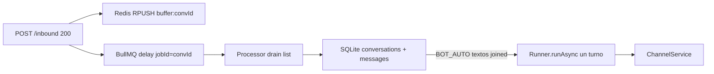

# Plan: huecos del POC Nest + ADK TS (repo `nestjs-adk`)

Eres el implementador en [nicobytes/nestjs-adk](https://github.com/nicobytes/nestjs-adk). **No** toques el monorepo Chatty. **No** clones el schema de Supabase ni RLS ni multi-org. Este `.md` es autocontenido: **no** crees `docs/`, `AGENTS.md` ni archivos extra en el POC; el contrato Slack/`toModelOutput` está más abajo en este mismo plan.

Objetivo: decidir **go / no-go** de “Runner `@google/adk` in-process en Nest **con una cola durable (BullMQ)**” como arquitectura teórica para Chatty. Fidelidad de demo, no de producción.

Lo que **ya está probado** (no lo reimplementes): ítems 0–2 y 4–5 del brief original. `LongRunningFunctionTool` + `functionResponse` resume, `sendButtons` durante `execute`, SQLite `DatabaseSessionService`, operator bypass del Runner, skills/BaseAgent. `BuiltInPlanner` y `ContextCacheConfig` **ausentes** — anótalo otra vez en RESULTS; no hace falta un tercer probe de imports.

---

## Qué no hace falta (y por qué)

**No clones el schema Chatty / no levantes Supabase.** La pregunta “historial CRM vs sesión ADK” se responde con **2–3 tablas SQLite** en el mismo archivo de sesiones (o un segundo sqlite). Un dump de `conversations` / `messages` / `inboxes` / RLS no cambia el contrato ADK y te arrastra a fidelidad alta.

Sí necesitas un **stub de producto**:

```
conversations(id uuid pk, status text, wa_id text, updated_at)
  status in ('BOT_AUTO','WAITING_HUMAN','HUMAN_ACTIVE')
messages(id, conversation_id, role, kind, body, payload_json, source, created_at)
  role in ('customer','bot','operator')
  kind in ('text','buttons','list','location','media','choice')
  payload_json: lo que se mandó / se recibió por el canal (opciones, buttonId, coords, url)
  body: fallback de texto para inbox (prompt, o "eligió B")
```

`conversation.id` **es** el `sessionId` que le pasas al `Runner`. El `wa_id` vive en la fila, no en el id de sesión (hoy el POC usa `whatsapp:{phone}:{digits}` — eso hay que **dejar de usar** en estos experimentos).

**No** hace falta: Graph real, Kapso, firma Meta, media inbound, status webhooks, FCM, activate/reminders de verdad, credenciales por tenant. Un `FakeWhatsAppSink` (el `ChannelService` actual) basta. El webhook puede seguir siendo `POST /inbound`.

**Sí** hace falta un buffer debounce **barato** (300–500 ms, no 800 de prod): es el patrón real de Chatty y es una de las razones de tener Bull. Ver experimento A4.

**No** portes Amaru Python. Un `LlmAgent` + `ask_choice` es suficiente. El orchestrator BANT no decide este go/no-go.

---

## Preguntas que este POC debe cerrar

Si alguna falla en serio, RESULTS.md `no-go` y paras. No apiles features.

1. **Bull delante del Runner:** ack HTTP inmediato, el job corre `runAsync`, un crash/retry no manda los botones dos veces.
2. **Buffer debounce:** varios inbound en &lt; N ms se vuelven **un** `runAsync` con los textos juntos (patrón Chatty: Redis list + job delayed + `jobId` estable).
3. **¿Vale la pena el processor?** No es dogma. Hay que medir: webhook 200, buffer, retry, restart, y si el HTTP de **otra** conversación sigue vivo mientras `runAsync` corre. Si el único win es “el código está en un `@Processor`” y A1/A4/A5 fallan, no vale.
4. **Pausa Eve + cola:** el job 1 pausa (`ask_choice`); el job 2 (clic) resume con `functionResponse`. Sobrevive restart de Nest si Redis + SQLite siguen.
5. **`sessionId` = `conversations.id`**, WhatsApp identity aparte.
6. **HITL:** `WAITING_HUMAN` / `HUMAN_ACTIVE` persiste inbound, **no** llama al Runner, no manda bot.
7. **Operador visible al agente:** `sendText` al canal **y** `append` a la sesión ADK (sin LLM). El siguiente `runAsync` del bot ve al humano.
8. **Dos stores, un contrato:** tabla `messages` (CRM) vs `session.events` (ADK). Quién es fuente de qué, y que un replay no requiera rehidratar historial a mano en el prompt.
9. **Canal rico en el inbox del operador:** botones/listas/location/media que la **tool** manda por `ChannelService` **no** viven como burbuja en la sesión ADK (ahí hay `functionCall`). Tienen que copiarse a `messages` con `kind` + `payload_json` o el operador no ve qué se mandó a WhatsApp.
10. **Retry vs tool con side effect:** `ask_choice` ya pegó al canal; Bull reintenta el mismo job → **no** segundo `sendButtons`.

Irrelevante para el go/no-go: playground ADK UI, agents `routing` / `sequential_flow`, WhatsApp Graph, schema Chatty.

---

## Arquitectura del experimento



Redis: local (`localhost:6379`) o Redis in-process si encuentras uno trivial. Documenta en README `docker run redis`. Si Redis es un dolor de 1h, **para y marca ítem Bull como blocked** — no sustituyas con `setTimeout` (eso no es Bull).

Cola mínima, **no** clones Chatty:

- queue name `messages`
- inbound: `RPUSH buffer:{conversationId}` + `queue.add('process', { conversationId }, { jobId: conversationId, delay: BUFFER_MS })`. Si el jobId ya existe, el mensaje **igual entra al list**; no creas otro job (Chatty: duplicate jobId ignorado)
- `BUFFER_MS = 400` en tests (prod Chatty es `buffer_time` por agente; no copies 800)
- processor: `MULTI` `LRANGE`+`DEL` (o `LRANGE`+`DEL` atómico), junta `text` con `\n`, **un** `runAsync`
- si durante el job activo llegan más RPUSH: al terminar, si `LLEN > 0`, encola follow-up `jobId = ${conversationId}-${Date.now()}` delay 0 (Chatty `enqueueFollowUpIfBuffered`). Sin esto el buffer se pudre
- `attempts: 3`, backoff 1s
- processor llama `TurnService`, **no** el controller
- clics `kind: 'button'` **no** van al buffer de texto: job inmediato (si mezclas el clic con “hola” en el mismo drain, rompes Eve). Documenta esa regla

El webhook/`POST /inbound` **solo** push+enqueue + 200.

---

## Experimento A — Bull + Runner (obligatorio)

**A1. Ack vs trabajo.** `POST /inbound` retorna antes de que `runAsync` termine. Test: el 201/200 llega en &lt;100ms con un `FunctionTool` que `sleep(1500)` (o delay en el processor). El canal recibe el texto **después**.

**A2. Retry tras throw.** El processor tira en el intento 1 (flag en memoria). Intento 2 corre `runAsync` y manda texto. Test con worker real, no mock del queue.add.

**A3. Restart a mitad.** Encolar un job con delay 2s, `app.close()`, nuevo `createPocApp` contra **el mismo Redis + mismo SQLite**. El job corre. Esto es el análogo de “BackgroundTasks no sobrevive”; aquí **tiene** que sobrevivir.

Si A3 falla (Bull no reanuda), no-go de cola. El Runner in-process no sustituye durable jobs.

**A4. Buffer debounce (obligatorio — patrón Chatty).** No es “delay del LLM”. Es: el user manda 3 textos seguidos y el agente ve **un** turno.

Patrón (copia conceptual, no el código de Chatty):

1. Cada `POST /inbound` hace `RPUSH` del payload y `add(process, { jobId: conversationId, delay: 400 })`
2. Segundo y tercer POST dentro de 400ms: RPUSH otra vez; `add` con el mismo jobId falla “already exists” → OK
3. El processor drena la lista y llama `runAsync` **una vez** con `messageTexts.join('\n')` (o tres parts; lo importante es **un** run)

Tests:

- `it('batches three inbound texts into one runAsync')`: 3 POST rápidos; spy de `runAsync` / `host.inbound` **1** vez; el mensaje de usuario en session (o el arg del spy) contiene los 3 cuerpos
- `it('follow-up job drains texts that arrived while the worker was busy')`: mock/spy que el primer process dura más que un POST extra; al final hay segundo run o el drain del follow-up incluye el extra. Si omites follow-up, el extra se pierde → **fail** (Chatty ya se quemó con eso)

Clics y handoff **no** entran a esa list. Un `buttonId` en el mismo buffer que texto libre es no-go de Eve: encola aparte, delay 0.

**A5. HTTP vivo durante `runAsync` (¿el processor aísla algo?).** Job con tool `await sleep(1500)` (async, no `Atomics.wait`). En paralelo: `GET /health` u otro `POST /inbound` de **otra** `waId`.

- **Pass:** el segundo HTTP &lt; 200ms. El processor en el **mismo** proceso Nest igual sirve: `runAsync` cede en los `await` a Gemini.
- **Fail:** el event loop está bloqueado. Entonces Bull **en este proceso** no es “background de verdad”; RESULTS: hace falta worker **separado** (`Worker` en otro proceso) o no meter el Runner aquí. No implementes el worker separado en el POC; solo documenta el fail.

No uses `while(true)` sync para A5: falsearía Node.

---

## ¿Vale la pena correr el Runner en el processor?

Eso no se opina: se llena esta tabla en RESULTS.md.

| Win que Chatty necesita | ¿Lo da `runAsync` en el POST? (POC actual) | ¿Lo da Bull processor? | Evidencia |
|---|---|---|---|
| Meta/webhook 200 antes de Gemini (segundos) | No (el HTTP espera el turno) | Sí si A1 pass | A1 |
| Agrupar “hola”+“cómo estás” en un turno | No (un POST = un run) | Sí si A4 pass | A4 |
| Retry / restart de un turno a medias | No | Sí si A2+A3 pass | A2 A3 |
| No perder mensajes que llegan durante el run | Frágil | Sí si follow-up A4 pass | A4 follow-up |
| No bloquear otras conversaciones | Depende del event loop | A5: mismo proceso vs worker aparte | A5 |
| Pause Eve (`ask_choice`) | Ya funciona in-request | Debe seguir funcionando **después** de que el job 1 **terminó** (pausa ≠ job hanging) | B |

**Go de “sí, processor”:** A1 + A4 + A3. El Runner **no** se llama desde el controller de inbound.

**No-go de processor / no vale la pena:** A1 fail (encolas pero igual esperas el job en el POST con `job.waitUntilFinished` — trampa, no lo hagas); o A4 fail (Bull sin buffer es solo un `setTimeout` caro); o A5 fail **y** no estás dispuesto a un worker process en Chatty.

Trampa a evitar: `await job.waitUntilFinished()` en `/inbound`. Eso mata A1 y el sentido de Bull. El POST guarda y vuelve. El test A1 aserta tiempo de HTTP, no de job.

---

## Experimento B — Eve encima de Bull (obligatorio)

Flujo:

1. Job texto: el modelo llama `ask_choice`; `sendButtons` durante execute; job **completa** (pausa ADK no es job hanging).
2. `POST /inbound/interactive` encola `kind: 'button'`.
3. Job 2: `resume` con `functionResponse` (el código actual de `choiceResponseMessage`).

Tests:

- `paused === true` después del job 1; `messages` CRM tiene row `bot` tipo buttons o un flag `source=ask_choice`
- job 2: session events tienen `functionResponse.id === callId`, **no** `text === 'b'`
- **Restart entre job 1 y job 2:** Nest down/up; el clic igual resume. Pending choice sale de `session.events` (ya lo tienes en `findPendingChoice`). El fallback `pendingFromChannel` (memoria) **no** puede ser la única fuente — si solo vive en el array de `ChannelService`, restart pierde el pause. Ese es un fail de diseño: corrige a “solo session SQLite”.

---

## Experimento C — `conversation.id` = `sessionId` (obligatorio)

Stub `ConversationStore` (SQLite):

- `POST /inbound` `{ waId, text }` → find-or-create conversation `status=BOT_AUTO` → `sessionId = conversation.id` (uuid) → enqueue
- No más `whatsapp:phone:digits` como session ADK en este camino
- Guarda `wa_id` en la fila para el sink (`channel.bind(conversationId, 'fake', waId)`)

Test: dos `waId` distintos = dos `conversations.id` = dos sesiones ADK. Mismo `waId` = misma conversación abierta.

Cerrar: `POST /conversations/:id/close` pone un status `CLOSED` (o borras “open”). El siguiente inbound **crea otra** uuid. El Runner ve sesión nueva. Eso imita Chatty (`status != CLOSED`).

Si no puedes separar identity WhatsApp de session ADK, no-go de producto (HITL/export/bookings en Chatty cuelgan de `conversations.id`).

---

## Experimento D — HITL skip Runner (obligatorio)

`POST /conversations/:id/handoff` → `WAITING_HUMAN`.

Inbound con esa conversación:

- inserta `messages` role=customer
- **no** llama `runner.runAsync` (spy)
- **no** `sendButtons` / bot text

`POST /conversations/:id/release` → `BOT_AUTO`. El siguiente inbound sí corre el Runner.

No implementes el CRM Angular. Un endpoint basta.

---

## Experimento E — operador en la sesión ADK (obligatorio)

Hoy `/operator/reply` manda al canal y el agente **no** ve al humano. Para Chatty eso es no-go silencioso.

Contrato POC:

1. `channel.sendText` (igual que ahora)
2. `messages` insert role=operator
3. Append a ADK session **sin** `runAsync` del LLM. Usa la API de session service (`appendEvent` / equivalente en `@google/adk` 2.0 — busca en el paquete; no rehidrates un prompt a mano)

Test: operator dice “el precio es 100”; siguiente inbound del customer “¿cuánto era?”; `replyText` menciona 100. Si `appendEvent` no existe o el modelo no ve el evento, documenta fail: **el dual-write a session es obligatorio** o el CRM no puede coexistir con el Runner.

---

## Experimento F — historial CRM vs session ADK (obligatorio, sin Supabase)

Este es el experimento “¿hace falta el schema?”. Respuesta: **no el schema; sí el dual-write**.

Después de un turno BOT_AUTO con texto (sin pause):

| Store | Qué debe haber |
|-------|----------------|
| `messages` | 1 customer + 1 bot (cuerpos) |
| `session.events` | user content + model content (y tool calls si las hubo) |

Reglas a **demostrar** (tests + párrafo en RESULTS):

- El Runner **no** lee la tabla `messages` para armar el prompt. Solo `sessionService`.
- El CRM **no** parsea `session.events` para pintar el inbox. Solo `messages`.
- Un restart de Nest: ambos stores siguen (mismo sqlite).
- **Prohibido** el patrón del research TS: `select role, content from messages` → `history` → `agent.run({ history })`.

Si para que el bot recuerde tienes que copiar `messages` al prompt, no-go (paso atrás vs ADK session).

Opcional barato: `GET /conversations/:id/debug` devuelve `{ messages, sessionEventCount, sessionPreview }` para inspección humana. No clones columnas Chatty (`organization_id`, `wamid`, metadata CTWA).

El caso **texto** de F no basta. Botones/listas: experimento I.

---

## Referencia Slack / Eve `toModelOutput` (obligatoria si tocas tools, session o CRM)

Este markdown **es** la fuente. No crees `docs/`, `AGENTS.md` ni comentarios extra en el repo del POC: copia este plan y sigue esta sección. Fuentes oficiales: [Tools / toModelOutput](https://eve.dev/docs/tools), [HITL / ask_question](https://eve.dev/docs/human-in-the-loop), [slack-agent-skill](https://github.com/vercel-labs/slack-agent-skill/blob/main/SKILL.md).

### Qué hace Slack en Eve

Eve **no** guarda el JSON de Block Kit (botones, colores, bloques) en el historial que relee el LLM. Separa dos superficies:

| Superficie | Contenido |
|---|---|
| Canal Slack (plataforma) | Payload completo: `blocks`, actions, colores |
| Memoria del agente (sesión) | Resumen en texto que **tú** defines |

Cita (docs de tools): *By default the model sees the full `execute` return. When a tool returns rich data a channel needs for rendering but the model only needs the gist, project it down with `toModelOutput`.* `toModelOutput` *only affects the model*. Channel handlers and hooks still get the full output on `action.result`, *so a channel can render rich platform output (Slack Block Kit, say) the model never sees*.

Por qué:

1. **Tokens.** Un Block Kit puede ser cientos o miles de tokens. En 3–4 turnos agotas contexto y sube el costo.
2. **Alucinación de UI.** Si el LLM relee JSON de interfaz, en turnos siguientes tiende a escupir JSON crudo en vez de hablar.
3. **Abstracción.** Al cerebro no le importa el color del botón. Recuerda que pidió datos y qué decidió el usuario.

### Dos APIs de Eve (no las mezcles)

**1. `ask_question` (HITL built-in).** Sin `execute`. El modelo llama `{ prompt, options? }`. Esos args ya son pequeños (`id` / title). El adaptador pinta botones o un select. Resume: `inputResponses: [{ requestId, optionId }]`. No necesita `toModelOutput`: nunca hubo Block Kit en el return.

**2. `defineTool` + `toModelOutput` (tarjeta Slack / formulario).** `execute` **sí** puede devolver Block Kit. Por defecto el modelo vería ese JSON. `toModelOutput(executeReturn)` es lo **único** que entra al historial como tool result.

```ts
import { defineTool } from "eve/tools";
import { z } from "zod";

export default defineTool({
  name: "enviar_formulario_complejo",
  description: "Envía un formulario de aprobación a Slack",
  inputSchema: z.object({
    motivo: z.string(),
  }),

  // 1. LO QUE VE SLACK (UI) — action.result / canal
  // El LLM NUNCA lee este JSON de retorno.
  async execute({ motivo }) {
    return {
      blocks: [
        {
          type: "section",
          text: { type: "mrkdwn", text: `*Nueva Solicitud:*\n${motivo}` },
        },
        {
          type: "actions",
          elements: [
            {
              type: "button",
              text: { type: "plain_text", text: "Aprobar" },
              value: "si",
            },
            {
              type: "button",
              text: { type: "plain_text", text: "Rechazar" },
              value: "no",
            },
          ],
        },
      ],
    };
  },

  // 2. LO QUE VE EL MODELO (historial)
  // Eve pasa el resultado de execute. Lo que devuelvas aquí es lo ÚNICO
  // que se inyecta en el historial de la sesión.
  toModelOutput(_outputDeExecute) {
    return {
      type: "text",
      value:
        "Se mostraron las opciones de aprobación en la pantalla del usuario. Detente y espera su clic.",
    };
  },
});
```

Skill oficial (misma idea, return más chico): `execute` puede incluir `blocks: buildOrderBlocks(...)`; el modelo solo ve:

```ts
toModelOutput(output) {
  return { type: "text", value: `Order ${output.orderId}: ${output.status}` };
}
```

Historial interno típico **después** de la tool de vacaciones:

```
User: "Quiero pedir vacaciones"
Model: llama enviar_formulario_complejo(motivo=...)
Tool result: "Se mostraron las opciones… espera su clic."   ← toModelOutput
User (clic): action_id: aprobar_vacaciones                 ← optionId, no Block Kit
```

WhatsApp Graph (`type: interactive`, `action.buttons`, location pin) **es** el Block Kit de este POC. El inbox del operador (tabla `messages`) es el hilo que un humano tiene que **ver**, no el prompt del LLM. ADK **no** tiene `toModelOutput`: el analog es `return null` + `skipSummarization` en `ask_choice`, o un string corto **antes** de que ADK persista el return de `execute`. **Nunca** persistas Graph en `session.events`.

## Experimento I — mapping canal → historial CRM (obligatorio)

Eve tiene **dos** APIs. No las mezcles:

1. **[`ask_question`](https://eve.dev/docs/human-in-the-loop)** — tool **sin** `execute`. El modelo llama `{ prompt, options? }`. Esos args ya son pequeños (id/title). El canal pinta UI nativa. Resume: `inputResponses: [{ requestId, optionId }]`.
2. **[`toModelOutput`](https://eve.dev/docs/tools)** — tool **con** `execute` que **sí** puede devolver Block Kit / payload pesado. Por defecto el modelo vería el return entero. `toModelOutput(executeReturn)` proyecta **solo** lo que entra al historial del LLM. Canales y hooks siguen viendo el `action.result` completo (“Slack Block Kit, say”). Doc oficial: *“only affects the model”*.

El ejemplo Slack de vacaciones es **(2)**, no (1): `execute` → `{ blocks: [...] }`; `toModelOutput` → `{ type: "text", value: "Tarjeta enviada. Espera el clic." }`. El clic vuelve como `action_id` / `optionId`, no como JSON de Block Kit.

WhatsApp Graph (`interactive` / location) es el análogo de Block Kit: **wire + CRM**, nunca sesión del modelo.

Cuatro capas. Probar que no se mezclan:

| Capa | Qué guarda (Eve-like) | Qué **no** guarda |
|---|---|---|
| Wire (Graph / ChannelService) | Interactive completo, pin, media | — |
| CRM **messages** (operador) | Payload **renderizable**: `kind=buttons` + `options`, `kind=location` + coords. `body` = prompt/caption | No parsear `session.events`. No basta `body="se enviaron opciones"` sin `payload_json` |
| ADK **session — functionCall.args** | Intención pequeña del modelo: `{ prompt, options:[{id,title}] }` o `{ lat, lng, name }`. Equivale a `ask_question` args, **no** a Block Kit | Payload Graph (`type: interactive`, `action.buttons`, Block Kit) |
| ADK **session — tool result** (`toModelOutput`) | Texto corto: “Opciones mostradas. Espera el clic.” / “Pin enviado: Oficina.” Al clic: `functionResponse` `{ buttonId }` | El JSON de `execute` (blocks / Graph). Un user text sintético que **reemplace** al tool call |

**Fail** (anti-Eve Slack): copiar Graph/Block Kit al `functionResponse` / parts del modelo.

**Fail** (inbox): CRM sin `payload_json` de options/coords — el operador no pinta chips/pin. Eso **no** se arregla metiendo el JSON en la sesión.

**No es fail:** que el tool result sea exactamente el resumen `toModelOutput`. Eso es el contrato Slack. Tampoco es fail que `functionCall.args` conserve `{prompt, options}` pequeños (Eve `ask_question`); son tokens baratos y evitan alucinación de “qué pregunté”, no es UI.

**Dónde escribir el CRM:** `ChannelService.push` (un solo lugar). El session lo escribe ADK (functionCall + result proyectado). No dupliques el prompt como `kind=text` extra (H).

Contrato `messages` (stub):

| Channel `kind` | `messages.kind` | `body` (inbox) | `payload_json` |
|---|---|---|---|
| text | `text` | el texto | `{}` |
| buttons | `buttons` | el prompt | `{ prompt, options: [{id,title}], functionCallId }` — **options completas**, no un count |
| list | `list` | prompt | `{ prompt, buttonLabel?, sections \| options }` |
| location | `location` | name o `"lat,lng"` | `{ latitude, longitude, name, address }` |
| media | `media` | caption o filename | `{ url, mimeType, caption }` |
| inbound choice | `choice` | title de la opción o id | `{ buttonId }` — Eve `optionId` / `action_id` |

Clic: el operador lee “Sede Sucre” (title) desde el último `buttons` de esa conversación, no desde session.events.

POC `ask_choice` (ADK analog de (1)+(2)):

- `execute`: `sendButtons` (wire). Return interno puede ser el payload de canal.
- Proyección al modelo (analog `toModelOutput`): string corta, **nunca** el interactive de Meta. Long-running: hasta el resume el result puede ser null; eso también vale si no hay Graph en session.
- Resume: `functionResponse.buttonId`, no user text `"b"`.

Tests:

- `it('session tool result is a summary not channel json')`: tras pause, **ningún** event de session contiene `type: 'interactive'` / `blocks` / `action.buttons` de Graph. El tool result (si existe) es texto corto o null. CRM `kind=buttons` **sí** tiene options id/title (mismo set que el channel push).
- `it('functionCall args stay small intent not graph')`: `functionCall.args` puede tener `prompt` + `options[{id,title}]`. No tiene el wire de WhatsApp.
- `it('resume writes optionId to session and choice row to messages')`: `functionResponse.response.buttonId === 'b'`; messages `kind=choice` con title si se conoce. No hay user text `"b"` como única huella.
- `it('location payload is in messages; session result is gist')`: Messages: `kind=location` + coords. Session: args lat/lng **o** result “Pin enviado…”. **No** el JSON Graph de location en session.
- `it('operator inbox does not require parsing session events')`: `toInbox(messages)` solo tabla CRM; pinta prompt + N chips. Restart: rows en sqlite.

Chatty a futuro (no este repo): `reply_with_*` sigue emitiendo envelope; Nest last-mile Graph + dual-write `messages`; el `functionResponse` hacia Vertex/ADK es gist + `optionId` al clic. No rehidratar interactive JSON al prompt.

Fail a documentar: si ADK mete el return crudo de `execute` en history y no hay palanca tipo `toModelOutput` / `skipSummarization`, RESULTS = “hay que proyectar en el processor antes del session”, no “guardar Graph en session”.

## Experimento G — idempotencia de `ask_choice` en retry (obligatorio)

`ask_choice` tiene side effect (canal). Bull reintenta el **mismo** job después de que `sendButtons` ya corrió y luego el processor tiró (simula Graph 500 **después** del send, o un throw post-execute).

**Pass:** un solo `sendButtons` por `functionCallId` (ChannelService cuenta; o lock `SET` en sqlite `sent_tool_calls(id)`).

**Fail:** dos juegos de botones. En Chatty eso es doble WhatsApp. Si no hay palanca en ADK para “no re-ejecutar long-running ya yielded”, documenta: el processor debe snapshotear “ya pauseado” y en retry solo `resume` no-op o skip `runAsync`. Eso es diseño de cola, no de LLM.

---

## Experimento H — no duplicar outbound (importante, barato)

Hoy `observe()` manda **todo** texto de modelo al canal **y** la tool ya mandó botones.

Test: turno `ask_choice` → `channel.list` tiene **un** `kind=buttons` y **cero** (o uno explícitamente permitido) `kind=text` residual. Si el modelo habla y llama tool, define la regla del POC: **si hay long-running pause, no `sendText` de prosa**. Ajústalo en `observe()`. Si no se puede filtrar events, no-go de last-mile (WhatsApp doble).

---

## Qué no probar (ruido)

- `BuiltInPlanner` / `ContextCacheConfig` otra vez (ya fail; RESULTS: “port Amaru pierde thinking nativo y cache”)
- Skills zip / A2A / playground `/dev-ui`
- Multi-tenant tokens
- Celery vs Bull, FastAPI
- Worker process dedicado (solo se **justifica** si A5 fail; no lo construyas en el POC)

---

## Tests (nombres fijos)

1. `it('returns http before the runner finishes')` — A1
2. `it('retries a failed job and then runs the agent')` — A2
3. `it('runs a delayed job after nest restart')` — A3
4. `it('batches three inbound texts into one runAsync')` — A4
5. `it('follow-up job drains texts that arrived while the worker was busy')` — A4
6. `it('serves another conversation while runAsync is in flight')` — A5
7. `it('pauses on ask_choice in a queue job and resumes with functionResponse')` — B
8. `it('resumes a paused choice after nest restart')` — B restart
9. `it('uses conversation uuid as adk session id')` — C
10. `it('skips the runner when conversation is WAITING_HUMAN')` — D
11. `it('operator reply is visible to the next agent turn')` — E
12. `it('crm messages and adk session are dual-write not prompt injection')` — F
13. `it('ask_choice sendButtons is idempotent across job retry')` — G
14. `it('does not send extra text when ask_choice pauses')` — H
15. `it('session tool result is a summary not channel json')` — I (`toModelOutput`)
16. `it('functionCall args stay small intent not graph')` — I
17. `it('stores buttons payload on messages when ask_choice sends')` — I (CRM)
18. `it('resume writes optionId to session and choice row to messages')` — I
19. `it('location payload is in messages; session result is gist')` — I
20. `it('operator inbox does not require parsing session events')` — I

Gemini solo donde el modelo tiene que llamar `ask_choice` (B, E, H, I botones). Location/media en I puede ser stub del channel.

Live tests: `skipIf(!GOOGLE_API_KEY)` como ahora.

---

## RESULTS.md (entregable de decisión)

Rellena al cerrar. Compara con lo ya sabido del primer POC.

| Pregunta | Resultado | Evidencia |
|----------|-----------|-----------|
| ¿HTTP acka y Bull corre el Runner? | | |
| ¿Job delayed sobrevive restart Nest? | | |
| ¿3 textos → 1 runAsync (buffer)? | | |
| ¿Follow-up si llegó texto durante el job? | | |
| ¿Otra conversación HTTP viva durante runAsync? | | |
| **¿Vale la pena el processor vs run en el POST?** | sí / no / sí con worker aparte | tabla A |
| ¿Pause Eve + clic = functionResponse **en job**? | | |
| ¿Pause sobrevive restart (session, no RAM)? | | |
| ¿`conversations.id` = `sessionId`? | | |
| ¿HITL salta el Runner? | | |
| ¿Operador entra a session sin LLM? | | |
| ¿CRM `messages` ≠ prompt history? | | |
| ¿Botones/listas/clic quedan en `messages` para el operador? | | |
| ¿Session **result** es gist (`toModelOutput`), no Graph/Block Kit? | | |
| ¿Session **args** son intent pequeño (prompt+ids), no wire? | | |
| ¿Resume es optionId en session + row choice en CRM? | | |
| ¿Inbox se arma sin parsear session.events? | | |
| ¿Retry no duplica botones? | | |
| ¿Pause no duplica texto+botones? | | |
| BuiltInPlanner / ContextCache (ya no) | ausente | probe viejo |
| **¿Go para meter Runner+Bull en Chatty (un tenant, un agente verde)?** | sí / no / sí con condiciones | |
| **¿Go para portar Amaru/Be Unique a TS?** | no / más tarde | planner+cache+orchestrator |

Criterio:

- **Go teórico (canal + cola + runner):** A1–A4, B, C, D, G, **I** pass. A5 pass **o** “worker aparte” anotado. E y F pass o workaround `appendEvent`.
- **No-go:** resume es user text; retry duplica botones; `messages` al prompt; HITL no corta el Runner; Bull no sobrevive restart; **o** no puedes agrupar textos (A4); **o** el operador no ve botones/listas porque solo están en session.events / RAM de ChannelService; **o** el JSON de canal (Graph/Block Kit) entra al historial del modelo.
- **No vale la pena el processor** si A1 se implementó con `waitUntilFinished`, o A4 no existe (un job por mensaje = lo mismo que el POC actual con más Redis).
- **No-go de port de agentes Python:** sigue en pie por planner/cache/BANT; este plan **no** lo revierte.

Condiciones aceptables en un go: Redis obligatorio; un tenant; SQLite no Postgres; `appendEvent` raro pero funciona; `BUFFER_MS` de juguete; worker process **solo si A5 fail**.

---

## Ritmo

Día 1: stub + Bull A1–A5 (buffer + ¿vale processor?). Si A1 o A4 fallan, RESULTS y stop — el resto no justifica Bull.

Día 2: B, C, D.

Día 3: E, F, G, H, I (mapping inbox), RESULTS.md.

No abras WhatsApp real. No copies `projects/supabase`. No fusionar a Chatty.

## README

Añade: Redis, `pnpm test`, qué tests son live Gemini, link a RESULTS. Deja claro que `/whatsapp/*` Kapso es demo aparte y **no** es el camino de decisión; el camino de decisión es `/inbound` + Bull + sqlite stub.
