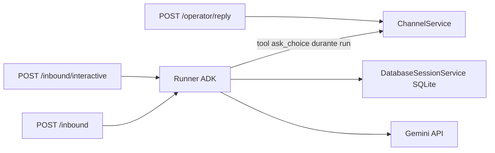

# Plan para el agente implementador: POC NestJS + Google ADK TS

Eres el implementador. Repo **nuevo y vacío**. No clones Chatty, WhatsApp Graph, Bull, ni multi-tenant.

**Pregunta a responder:** ¿un `Runner` de [`@google/adk`](https://github.com/google/adk-js) **in-process en Nest** puede hacer el patrón Eve (la tool pinta UI **durante** el turno, el clic **reanuda el mismo tool call**)? Si el ítem 2 falla, **paras** y documentas no-go. No sigas construyendo demos.

Auth: `GOOGLE_API_KEY` (Gemini API / AI Studio). Modelo: `gemini-2.5-flash` o `gemini-flash-latest` si el SDK lo acepta.

Docs oficiales a leer **antes** de codear:

- [FunctionTool TS](https://adk.dev/api-reference/typescript/classes/FunctionTool.html)
- [LongRunningFunctionTool](https://adk.dev/api-reference/typescript/classes/LongRunningFunctionTool.html)
- [Function tools / long-running](https://adk.dev/tools-custom/function-tools/)
- [Action confirmations](https://adk.dev/tools-custom/confirmation/)
- [Resume agents](https://adk.dev/runtime/resume/)
- [DatabaseSessionService](https://adk.dev/api-reference/typescript/classes/DatabaseSessionService.html)
- Human input / `getUserChoiceTool` + `requestInputTool` (adk-js ≥ 1.5, [release](https://github.com/google/adk-js/releases))

Usa las clases reales del paquete que instales. Si un nombre de este plan no exporta, busca el equivalente en `node_modules/@google/adk` y anótalo en RESULTS.md. No inventes un wrapper de “sesión a mano con historial SQL”.

---

## Fuera de alcance

- Meta / WhatsApp Cloud API, templates, firmas
- Redis, colas, retries, multi-tenant, HITL de producto
- Vertex Agent Runtime, ADC, `GOOGLE_CLOUD_PROJECT`
- UI HTML, autenticación, Docker “producción”
- Portar Amaru / BANT / RAG / skills de un producto real

Un `POST` que llama a Gemini y devuelve “hola” **no es el POC**.

---

## Stack

- Node 20+, TypeScript, NestJS (un `AppModule`)
- `@google/adk` última GA (`^1.5` o `^2` según npm)
- `zod` (schemas de tools)
- Persistencia: `DatabaseSessionService` con SQLite (MikroORM según el SDK). `InMemorySessionService` **solo** para el smoke del día 0; el ítem 4 exige archivo en disco
- Tests: Vitest o Jest. Tests que pegan a Gemini: `describe.skipIf(!process.env.GOOGLE_API_KEY)` y tag `integration`
- ESM: si Nest + `@google/adk` chocan (CJS/ESM), arréglalo (NodeNext / dynamic import). Si no encaja en ~30–60 min, el ítem 0 es **fail** y paras

Env:

```
GOOGLE_API_KEY=
SESSION_DB_URL=sqlite://./data/sessions.sqlite   # o el connection string que pida el SDK
```

`.env.example` + README de 20 líneas: `pnpm i`, `pnpm test`, `pnpm start`, `curl` de los 3 endpoints.

---

## Arquitectura

Un proceso Nest. El LLM y el canal fake viven juntos.



- `ChannelService`: array in-memory de `{ sessionId, kind, payload, at }`. `sendButtons`, `sendText`, `list(sessionId)`. Lo usan **la tool ADK** y **el operador**
- `AdkHostService`: crea `Runner` una vez, `createSession` con `sessionId` que manda el cliente (UUID de conversación)
- Tools: `FunctionTool` / `LongRunningFunctionTool` construidos en un **factory Nest** (`useFactory`) que cierra sobre `ChannelService`. No un `execute` suelto en un archivo sin DI

Constantes: `APP_NAME = 'poc'`, `USER_ID = 'user_1'` (un usuario). El cliente elige `sessionId`.

---

## Layout sugerido

```
src/
  main.ts
  app.module.ts
  channel/channel.service.ts
  channel/channel.types.ts
  adk/adk-host.service.ts          # Runner + session service
  adk/ask-choice.tool.ts           # factory: ChannelService -> LongRunningFunctionTool
  adk/feature-probe.agent.ts       # ítem 3: orchestrator chico
  http/inbound.controller.ts       # POST /inbound, /inbound/interactive
  http/operator.controller.ts      # POST /operator/reply
  http/dto.ts
test/
  smoke.integration.spec.ts
  send-during-tool.integration.spec.ts
  resume-same-turn.integration.spec.ts
  operator-bypass.spec.ts
  session-restart.integration.spec.ts
  feature-probe.spec.ts            # imports + 6/8 checklist
RESULTS.md                         # tabla go/no-go (obligatorio)
```

---

## Orden de implementación (pass/fail)

No saltes. Si fallas en serio, escribe RESULTS.md y para.

### Ítem 0 — Smoke

`POST /inbound` `{ sessionId, text: "di solo hola" }` → `runner.runAsync` → texto.

**Fail:** SDK no corre dentro de Nest (ESM, DI, event loop).

### Ítem 1 — Tool llama Nest **durante** `run()`

Tool `ask_choice({ prompt, options: [{id, title}] })`:

1. `channel.sendButtons(sessionId, prompt, options)` **dentro de `execute`**
2. No esperes a que `runAsync` termine para “renderizar”

Test: espía `sendButtons`. Debe haberse llamado **antes** de que el async iterator de `runAsync` cierre.

**Fail:** la tool solo retorna JSON y Nest manda botones después del run (modelo Chatty actual). Eso no prueba Eve.

### Ítem 2 — Pause / resume del **mismo** turno (el POC)

Este es el único ítem que justifica el repo.

Flujo:

1. Inbound: “pregúntame A o B con la tool”
2. El modelo llama `ask_choice`; la tool manda botones y el runner **pausa** (no inventa “elegiste A”)
3. `POST /inbound/interactive` `{ sessionId, buttonId: "b" }`
4. Segundo `runAsync` continúa con **function response** del tool call, no con `newMessage` texto `"b"`

APIs a probar **en este orden** (la primera que pause de verdad gana):

1. `LongRunningFunctionTool` — el run termina tras el tool; el resume manda `FunctionResponse` con el **mismo function-call id** (y `invocationId` si [Resume](https://adk.dev/runtime/resume/) está on)
2. Exports `getUserChoiceTool` / `requestInputTool` (paridad Python, adk-js 1.5+)
3. `toolContext.requestConfirmation({ hint, payload })` ([confirmations](https://adk.dev/tools-custom/confirmation/))

Instrumenta eventos del 2º run. **Pass:** hay `functionResponse` (o confirmation response) ligado al call original. **Fail:** el segundo run es `role: user` + texto `"b"` con historial. Si 1–3 se comportan así, **ítem 2 fail, no-go, paras**.

Guarda en RESULTS.md el mecanismo que funcionó (clase + snippet de resume).

### Ítem 3 — Probe de APIs (no portes un producto)

Un agente mínimo que **toque** cada API. Si no exporta, marca ausente. Pass del ítem: **≥ 6/8 existen y un test lo demuestra** (import o run corto). Fail duro: no hay `BaseAgent` usable, o no hay corte de turno post-tool, **o** skills no existen (anótalo; skills ausentes solas no paran el repo si 2 pasó, pero bajan el go de Chatty).

| # | API Python de referencia | Qué hacer en JS |
|---|--------------------------|-----------------|
| A | `BaseAgent` custom run | Orchestrator 2 hijos: qualifier silencioso → customer. Qualifier **no** va al canal |
| B | `BuiltInPlanner` + thinking | Thoughts ocultos; el canal no los ve |
| C | after-tool stop | Equivalente a `skip_summarization` / no ReAct extra tras `ask_choice` |
| D | instruction estática + por turno | Prefijo fijo + fecha o `sessionId` dinámico |
| E | `output_schema` sin tools | Qualifier solo JSON (zod/schema) |
| F | `on_tool_error` / error callback | Tool que tira; el turno no explota crudo |
| G | `App` + context cache | Existe `ContextCacheConfig` o no |
| H | Skills / SkillToolset | `list_skills` / `load_skill` o el export actual |

### Ítem 4 — Sesión persistente

`sessionId` lo elige el cliente. Dos procesos Nest (start → inbound → kill → start → inbound follow-up). Mismo archivo SQLite.

**Fail:** rehidratas `history[]` a mano desde una tabla tuya. Eso es no-go de session service.

### Ítem 5 — Dos entradas, un `ChannelService`

- `/inbound` → runner
- `/inbound/interactive` → resume (ítem 2)
- `/operator/reply` `{ sessionId, text }` → `channel.sendText` **sin** runner

**Pass:** humano no dispara LLM; la tool y el operador mutan el mismo log de canal.

### Ítem 6 — Observabilidad

Logger estructurado: `tool_call`, `channel_send`, `pause`, `resume`, `final_text`. El test de resume **parsea eventos ADK**, no solo `{ replyText }`.

---

## Tests mínimos (nombres fijos)

1. `it('sends buttons during the tool call')` — ítem 1
2. `it('resumes the same turn from button id')` — ítem 2; aserta function-response, no user text
3. `it('operator reply bypasses the runner')` — ítem 5; mock/spy del Runner `not.toHaveBeenCalled()`
4. `it('session survives process restart')` — ítem 4; puedes simular restart re-instanciando `AdkHostService` contra el mismo SQLite (más estable que spawn)

Gemini Flash. Cero tenants.

---

## Entregable: RESULTS.md

Rellena al cerrar (pass / fail / ausente + path del test):

| Pregunta | Resultado | Evidencia |
|----------|-----------|-----------|
| ¿Nest corre `Runner.runAsync`? (ítem 0) | | |
| ¿Tool llama un provider Nest **durante** el turno? | | |
| ¿Resume es function-response o user text? | | |
| Mecanismo de pause (clase ADK) | | |
| ¿BaseAgent orchestrator? | | |
| ¿Skills? | | |
| ¿Context cache? | | |
| ¿Session persistente con id propio? | | |
| Score ítem 3 (n/8) | | |
| **¿Vale portar un agente de producción a TS?** | sí / no / solo agente verde | |

Criterio Chatty (cópialo al final de RESULTS.md):

- **Go:** ítem 2 pass de verdad + ítem 1 + orchestrator/corte de turno + session persistente + test A/B→clic A
- **No-go:** clic = user text, o session a mano, o no hay BaseAgent/stop-after-tool, o el único win es “está en TypeScript”
- Irrelevante: BackgroundTasks, “Nest llama Gemini”, UI bonita

---

## Ritmo

Día 1: 0 → 1 → 2. Si 2 falla en la mañana, RESULTS.md y stop.

Día 2: 3 → 5 → 6 → 4.

No refactorices de “framework”. No añadas WhatsApp real “para que se vea”.
